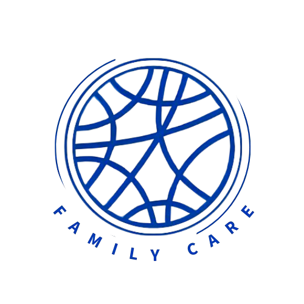

# FECAP - Fundação de Comércio Álvares Penteado

<p align="center">
<a href= "https://www.fecap.br/"></a>
</p>

# Projeto Family Care 

## Nome do Grupo

## Integrantes:<a href="">Luca Filgiola Silvestri</a>, <a href="">Melissa Lequipe Lecona</a>, <a href="">Nayan Pinho de Oliveira</a>, <a href="">Nicolle Maria Gonçalves Firminio</a>,<a href="">Jean Costa</a>,<a href="">Thiago Dias</a>.

## Professores Orientadores: <a href="https://www.linkedin.com/in/edsonbarbero/">Edson Barbero</a>, <a href="https://www.linkedin.com/in/victorbarq/">Victor Bruno Alexander Rosetti de Quiroz</a>,<a href="https://www.linkedin.com/in/lucymari/">Luci Mari Tabuti</a>,<a href="https://www.linkedin.com/in/eduardo-savino-gomes/">Eduardo Savino Gomes</a>,<a href="https://www.linkedin.com/in/aimarlopes/">Aimar Martins Lopes</a>.


## Descrição

<p align="center">

</p>


</p>

<br>O Projeto Family Care é desenvolver uma solução tecnológica para aprimorar a comunicação entre cuidadores de idosos e seus familiares, com foco nas necessidades das agências de cuidadores. A proposta inclui a criação de um aplicativo para familiares e um sistema de software para a agência, ambos projetados para aumentar a transparência e facilitar o gerenciamento do atendimento.

<br> Com essa solução, os familiares poderão fazer comentários em tempo real sobre o atendimento e acompanhar registros atualizados dos cuidadores sobre o bem-estar do idoso. Buscando fortalecer a relação de confiança entre agência e cliente, promovendo um atendimento mais próximo, transparente e humanizado.

## Funcionalidades

* Ser um software que integra a comunicação entre agência, cuidadores e familiares
* Transparência e Confiança na sua comunicação com cuidadores e familiares atendendo diretamente as suas necessidades, promovendo confiança e lealdade entre os clientes e a agências.
* Eficiência operacional, centralização de informações e atualizações feitas de forma rápida e acessível. O Family Care é um software que reduz o tempo gasto pelos cuidadores com comunicações repetitivas, permitindo que se concentrem mais no cuidado direto ao idoso.

## 🛠 Estrutura de pastas

-Raiz<br>
|<br>
|-->documentos<br>
  &emsp;|-->antigos<br>
  &emsp;|Documentação.docx<br>
|-->executáveis<br>
  &emsp;|-->windows<br>
  &emsp;|-->android<br>
  &emsp;|-->HTML<br>
|-->imagens<br>
|-->src<br>
  &emsp;|-->Backend<br>
  &emsp;|-->Frontend<br>
|readme.md<br>

A pasta raiz contem dois arquivos que devem ser alterados:

<b>README.MD</b>: Arquivo que serve como guia e explicação geral sobre seu projeto. O mesmo que você está lendo agora.

Há também 4 pastas que seguem da seguinte forma:

<b>documentos</b>: Toda a documentação estará nesta pasta.

<b>executáveis</b>: Binários e executáveis do projeto devem estar nesta pasta.

<b>imagens</b>: Imagens do sistema

<b>src</b>: Pasta que contém o código fonte.

## 🛠 Instalação

<b>Android:</b>

Faça o Download do JOGO.apk no seu celular.
Execute o APK e siga as instruções de seu telefone.

```sh
Coloque código do prompt de comnando se for necessário
```

<b>Windows:</b>

Não há instalação! Apenas executável!
Encontre o JOGO.exe na pasta executáveis e execute-o como qualquer outro programa.

```sh
Coloque código do prompt de comnando se for necessário
```

<b>HTML:</b>

Não há instalação!
Encontre o index.html na pasta executáveis e execute-o como uma página WEB (através de algum browser).

## 💻 Configuração para Desenvolvimento

Descreva como instalar todas as dependências para desenvolvimento e como rodar um test-suite automatizado de algum tipo. Se necessário, faça isso para múltiplas plataformas.

Para abrir este projeto você necessita das seguintes ferramentas:

-<a href="https://godotengine.org/download">GODOT</a>

```sh
make install
npm test
Coloque código do prompt de comnando se for necessário
```

## 📋 Licença/License


## 🎓 Referências

Aqui estão as referências usadas no projeto.

1. <https://github.com/iuricode/readme-template>
2. <https://github.com/gabrieldejesus/readme-model>
3. <https://chooser-beta.creativecommons.org/>
4. <https://freesound.org/>
5. <https://www.toptal.com/developers/gitignore>
6. Músicas por: <a href="https://freesound.org/people/DaveJf/sounds/616544/"> DaveJf </a> e <a href="https://freesound.org/people/DRFX/sounds/338986/"> DRFX </a> ambas com Licença CC 0.
